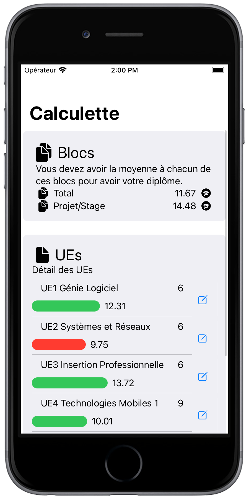
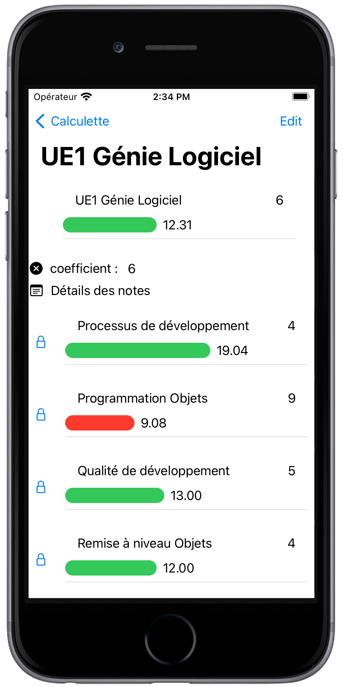

# iOS_TP2_2023_CalculetteMoyenne

_À rendre pour le jeudi 22 juin 2023 - 12h00_  
_Rappel: les retards sont sanctionnés à raison de 1 point par heure commencée (par exemple, rendu à 2h23 le lundi 05 juin => -3 points_)

**Réaliser une application de simulation et de calcul de moyenne**

# Maquette
Une maquette est faite de la manière suivante:
- il faut la moyenne à tous les ```Bloc```s pour avoir son diplôme,
- la note d'```Bloc``` est la moyenne pondérée des ```UE```s le composant
- la note d'une ```UE``` est la moyenne pondérée des ```Matière```s la composant

En LP PM, il y a 7 ```UE```s et 2 ```Bloc```s.  
  
Liste des ```UE```s et de leurs ```Matière```s:
1. **UE 1 : Génie Logiciel (coeff. 6)**
  - Processus de développement (coeff. 4)
  - Programmation Objets (coeff. 9)
  - Qualité de développpement (coeff. 5)
  - Remise à niveau objets (coeff. 4)
2. **UE 2 : Systèmes et réseaux (coeff. 6)**
  - Internet des Objets (coeff. 4)
  - Réseaux (coeff. 4)
  - Services Mobiles (coeff. 4)
  - Système (coeff. 5)
3. **UE 3 : Insertion Professionnelle (coeff. 6)**
  - Anglais (coeff. 5)
  - Economie (coeff. 4)
  - Gestion (coeff. 3)
  - Communication (coeff. 4)
4. **UE 4 : Technologies Mobiles 1 (coeff. 9)**
  - Android (coeff. 6)
  - Architecture de projets C# .NET (1) (coeff. 5)
  - C++ (coeff. 4)
  - Swift (coeff. 5)
5. **UE 5 : Technologies Mobiles 2 (coeff. 9)**
  - Architecture de projets C# .NET (2) (coeff. 4)
  - Client/Serveur (coeff. 4)
  - iOS (coeff. 5)
  - Multiplateformes (coeff. 3)
  - QT Quick (coeff. 5)
  - Xamarin (coeff. 5)
6. **UE 6 : Projet (coeff. 9)**
  - Projet (coeff. 1)
7. **UE 7 : Stage (coeff. 15)**
  - Stage (coeff. 1)

Liste des ```Bloc```s:
1. Total (```UE```s 1, 2, 3, 4, 5, 6 et 7)
2. Projet/Stage (```UE```s 6 et 7)

# Captures d'écran

Voici des exemples de ce qui est attendu:  
## Page 1 : Résumé des notes des ```Bloc```s et des ```UE```s
On peut avoir accès **en lecture** aux notes des ```Bloc```s et des ```UE```s, mais on ne peut pas les modifier.  
On peut cliquer sur l'image à droite de l'UE pour obtenir les détails de l'```UE``` et passer à la page suivante.  


## Page 2 : Notes de l'UE
On a accès aux notes de l'```UE```. On peut cliquer sur le cadenas pour passer en mode édition de la note et on gère alors le geste sur la capsule. Si la note est < 10, la capsule est en rouge (sauf pour Maia, en vert). Si la note est >= 10, la capsule est en vert (sauf pour Maia, en rouge).  
Un tap sur _Edit_ permet de passer en mode édition.  


## Page 3 : Edition de l'UE
En mode édition, on peut changer :
- le coeff. de l'```UE```
- la description de l'```UE```
- ajouter des ```Matière```s
- enlever des ```Matière```s
- modifier des ```Matière```s
  - changer le nom 
  - changer le coefficient 
