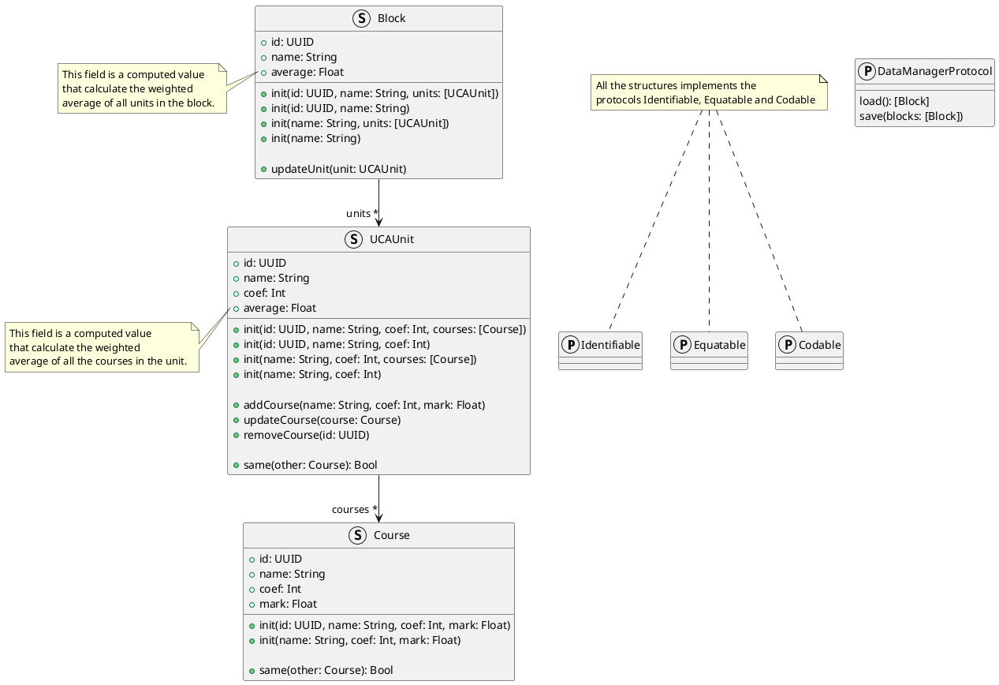
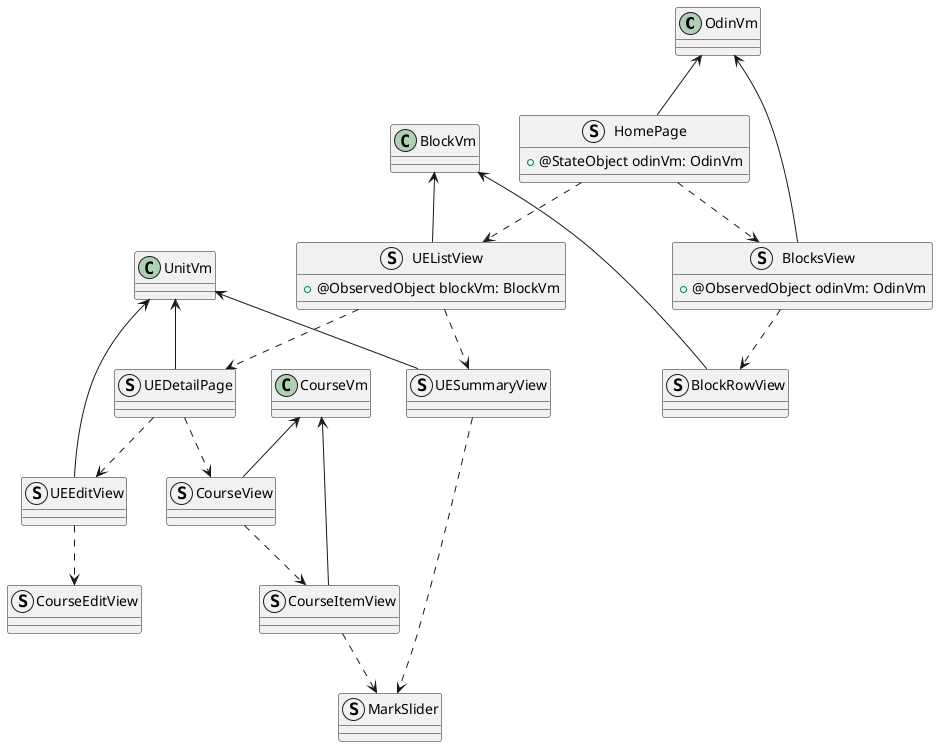
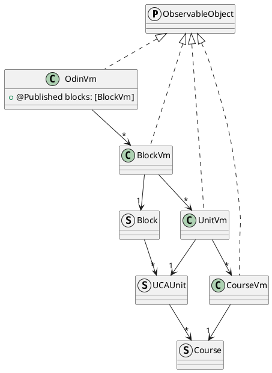
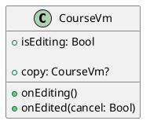
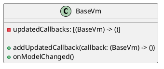

# UCAverage

[](https://codefirst.iut.uca.fr/florent.marques/ucaverage-ios)

# Overview


This project is a calculator developed with SwiftUI that calculates your average. It allows you to display your notes in each block and each subject. A color code is in place to let you know if you have a good grade or not. You can simulate your notes by adjusting the sliders.

This project uses an MVVM architecture adapted for SwiftUI. You can find some explanations [here](#mvvm-architecture).

You can find the instructions [here](CONSIGNES.md).

# Screenshots


# Features
- [X] List all blocks
- [X] List all units
- [X] Detail of one unit
- [X] List courses in unit
- [X] `Capsule`
    - [X] Adjust grade of the course
    - [X] Lock `Capsule` to lock the grade
    - [X] Color code
- [X] Edit unit
    - [X] Name
    - [X] Coefficient
    - [X] Add course in unit
    - [X] Edit course in unit
    - [X] Delete course in unit
- [X] Json persistence
- [x] Navigation
- [X] Pages
- [X] Custom Views
- [X] Bindings (State, Binding, StateObject, ObservedObject)
- [X] Notifications with `Hashable`
- [ ] Generic Viewmodel for editing

# MVVM Architecture

In this section, I will explain the concept of MVVM architecture in SwiftUI. All the architecture is explained [here](https://codefirst.iut.uca.fr/documentation/mchSamples_Apple/docusaurus/iOS_MVVM_guide/docs/intro/).

## Model

Apple strongly recommends using **structures** in Swift. So we will follow the guidelines to write our model.



## Views

The views will bind to the property wrapped by the viewmodel and will send user actions to the viewmodel to execute logics.

The main view, in this project `HomePage`, will own the top viewmodel `OdinVm` as `@StateObject`. This viewmodel will be passed to other views with `@ObservedObject`.



## ViewModels

Viewmodels in Swift is composed of two main points:
- Wrapping
- Editing
- Notifications

Even if structures are heavily used and advised in Swift, viewmodels have to be classes in order to use the observable mechanism.



### Model wrapping

The first goal of the `Viewmodel` is to wrapped the model and all properties of the model in order to separate the `View` from the `Model` and the `Model` from the `View`.

All viewmodels must conform to the `ObservableObject` protocol. This protocol indicates that the object conforming to it, is attached to a publisher that emits nofitications just before the object has changed.

All properties in the `Viewmodel` must be mark `@Published` to benefiting from the notification system.

### Editing

The editing part will provide a copy of the actuel Viewmodel, this copy will be used by the edition view as binding property. The user will entered in edition mode with `onEditing()` method then the `copy` property will be set with a copy of the actuel model wrapped in the viewmodel. At the end of edition, the viewmodel will copy the model of the copy into himself to update its model with the new model.

The viewmodel provide a `isEditing` property to know the state of the edition.



### Notifications

The notification part is to set up the `Observer/Observable` pattern. This pattern allows to send notifications to an unknown object which has subscribed to notifications.

In Swift, we will write this pattern with callbacks.

When the view updates the viewmodel by the properties, the viewmodel changes the property of the wrapped model thanks to the `didSet` of the property. After that, it will fire the `onModelChanged()` to tell to the subscribers that the model has changed.



# Getting Started

## Prerequisites
- iOS 13
- XCode 14.3
- iOS Simulator or iOS Device

## Installation
1. Clone the repo
   ```sh
   git clone https://codefirst.iut.uca.fr/git/florent.marques/ucaverage-ios.git
    ```
2. Open the project with XCode
3. Run the project on iOS Simulator or iOS Device
4. Enjoy your application

# Authors

- Florent Marques
    - [](https://github.com/flomSStaar)
    - [](https://www.linkedin.com/in/florent-marques)
