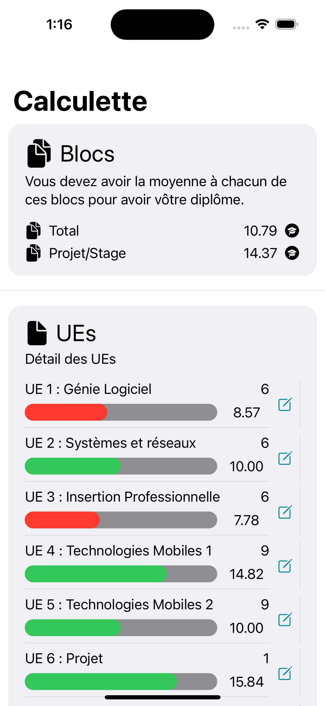
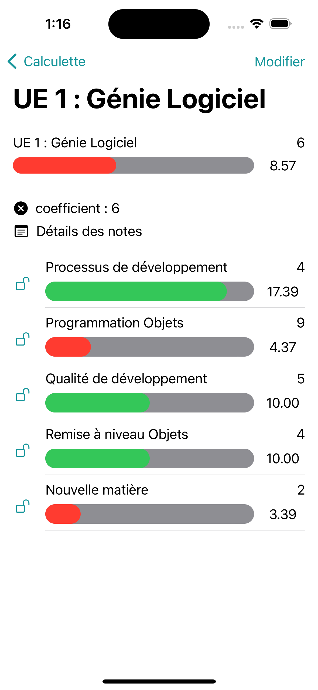
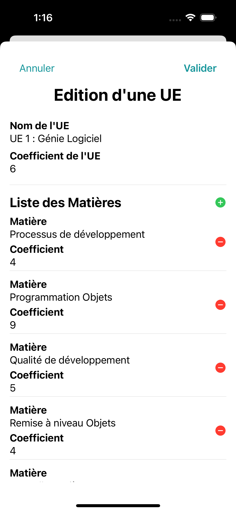
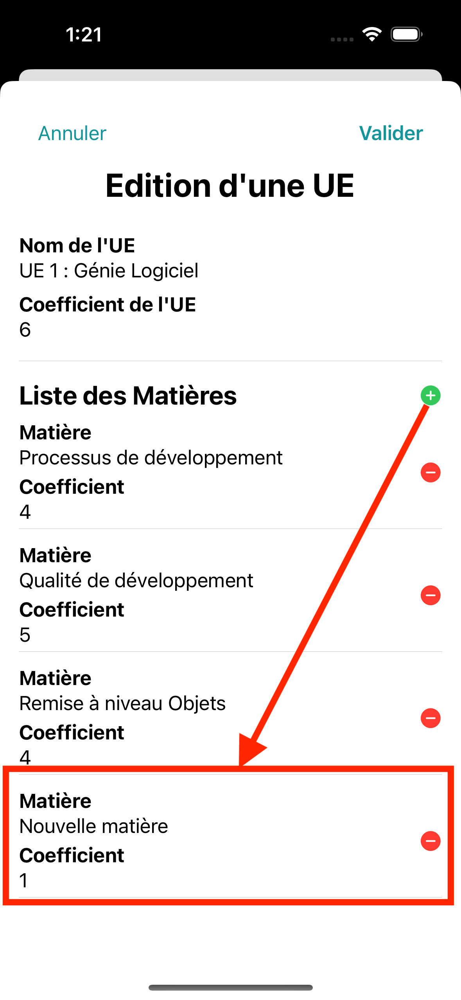
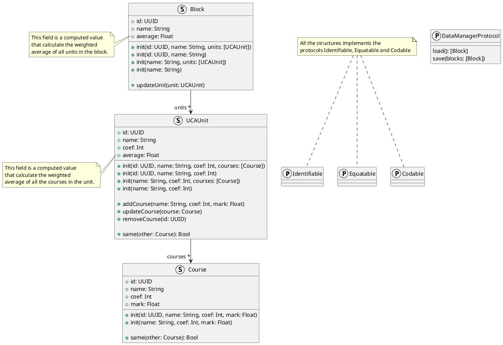

# UCAverage

[](https://codefirst.iut.uca.fr/florent.marques/ucaverage-ios)

# Overview


This project is a calculator developed with SwiftUI that calculates your average. It allows you to display your notes in each block and each subject. A color code is in place to let you know if you have a good grade or not. You can simulate your notes by adjusting the sliders.

This project uses an MVVM architecture adapted for SwiftUI. You can find some explanation [here](#mvvm-architecture).

You can find the instructions [here](CONSIGNES.md).

# Screenshots





# Features
- [X] List all blocks
- [X] List all units
- [X] Detail of one unit
- [X] List courses in unit
- [X] `Capsule`
    - [X] Adjust grade of the course
    - [X] Lock `Capsule` to lock the grade
    - [X] Color code
- [X] Edit unit
    - [X] Name
    - [X] Coefficient
    - [X] Add course in unit
    - [X] Edit course in unit
    - [X] Delete course in unit
- [X] Json persistence
- [x] Navigation
- [X] Pages
- [X] Custom Views
- [X] Bindings (State, Binding, StateObject, ObservedObject)

# MVVM Architecture

In this section, I will explain the concept of MVVM architecture in SwiftUI. All the architecture is explained [here](https://codefirst.iut.uca.fr/documentation/mchSamples_Apple/docusaurus/iOS_MVVM_guide/docs/intro/).

## Model

Apple strongly recommends using **structures** in Swift. So we will follow the guidelines to write our model.



## Views

## ViewModels

# Getting Started

## Prerequisites
- iOS 13
- XCode 14.3
- iOS Simulator or iOS Device

## Installation
1. Clone the repo
   ```sh
   git clone https://codefirst.iut.uca.fr/git/florent.marques/ucaverage-ios.git
    ```
2. Open the project with XCode
3. Run the project on iOS Simulator or iOS Device
4. Enjoy your application

# Authors

- Florent Marques
    - [](https://github.com/flomSStaar)
    - [](https://www.linkedin.com/in/florent-marques)
